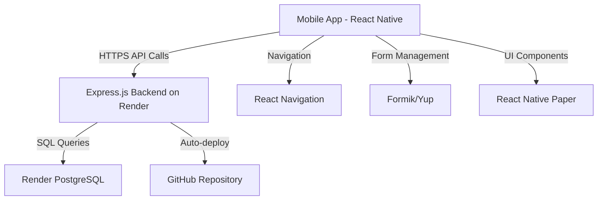

# Church Census System - Design Document

## Overview

The Church Census System is a mobile application that enables church administrators to manage comprehensive member information directly on their Android or iOS devices. Built with React Native and Expo, with a Node.js backend hosted on Render.com, this solution is 100% free. The backend API and PostgreSQL database are deployed on Render's free tier, accessible from anywhere with internet connection.

## Architecture

### Technology Stack

**Mobile App:**
- React Native (Expo) for cross-platform mobile development (Android & iOS)
- React Native Paper for UI components (free & open-source)
- React Navigation for screen navigation
- Formik + Yup for form handling and validation
- Axios for API calls

**Backend (Render.com - 100% Free Hosting):**
- Node.js with Express.js for REST API
- PostgreSQL database (hosted on Render.com free tier)
- Sequelize ORM for database operations  
- Automatic HTTPS (SSL included)
- Auto-deploy from GitHub repository

**Render.com Free Tier:**
- Free PostgreSQL database (1GB storage)
- Free Web Service for backend API
- Automatic deploys from Git
- HTTPS included (free SSL)
- No credit card required
- Always online, accessible from anywhere

**Important Note - Free Tier Limitation:**
- Free tier spins down after 15 minutes of inactivity
- Takes ~30 seconds to wake up on first request after sleep
- **Solution: Use free cron job service to ping every 14 minutes**

**Keep-Alive Solutions (All Free):**

**Option 1: Cron-Job.org (Recommended)**
- Free account at cron-job.org
- Create job to ping your API every 14 minutes: `https://your-app.onrender.com/api/health`
- Keeps server awake 24/7
- Free forever, no limits

**Option 2: UptimeRobot**
- Free monitoring service
- Pings your app every 5 minutes
- Also provides uptime monitoring

**Option 3: EasyCron**
- Free tier: pings every 20 minutes (not ideal, but works)
- Alternative to cron-job.org

**Recommended Setup:**
1. Add a simple health check endpoint in your backend: `GET /api/health` (returns {status: 'ok'})
2. Create cron-job.org account
3. Set up cron job to hit your health endpoint every 14 minutes
4. Your app stays awake 24/7 for free!

**Why Render.com:**
- Zero setup - just connect GitHub repo
- Automatic HTTPS
- No server management needed
- Free PostgreSQL database (1GB = ~10,000+ members)
- Always online (unlike local PC)
- Accessible from anywhere with internet
- Easy database backup/restore from dashboard

### System Architecture



### Deployment Architecture

**Render.com Cloud Setup:**
```
GitHub Repository (Your Code)
     ↓ (Auto-deploy)
Render.com Cloud Platform
├── Web Service (Express.js API) - HTTPS://your-app.onrender.com
└── PostgreSQL Database (1GB free)
     ↓ (Internet connection)
Multiple Mobile Devices (Anywhere)
├── Staff Member 1 (connects via internet)
├── Staff Member 2 (connects via internet)
└── Admin (connects via internet)
```

### Setup Requirements

**Development Machine (Your PC):**
- Node.js installed
- Git installed
- Code editor (VS Code)
- Internet connection

**Render.com Setup:**
1. Sign up at render.com (free, no credit card)
2. Create PostgreSQL database
3. Create Web Service (connect GitHub repo)
4. Add environment variables (database URL)
5. Automatic deployment on git push

**No Server Needed:**
- Everything runs on Render's infrastructure
- No local server setup
- No port forwarding
- No network configuration

## Components and Interfaces

### Mobile App Screens

#### 1. Home Screen
- Dashboard showing total members count
- Quick action buttons: Add Member, View All, Search
- Statistics cards (optional): Total families, Housing type breakdown

#### 2. Add Member Screen
- Scrollable form with sections
- Input fields for all member data
- Native picker for Housing Type dropdown
- Checkbox for Patta (conditional visibility)
- Save button (fixed at bottom)

#### 3. Member List Screen
- Scrollable FlatList of member cards
- Each card shows: Name, Phone, Community
- Tap card to view details
- Search bar at top
- Filter icon for advanced filters
- Floating Action Button (FAB) to add new member

#### 4. Member Detail Screen
- Full member information in sections
- Edit and Delete buttons
- Back navigation

#### 5. Search & Filter Screen
- Search by name input
- Filter by Community dropdown
- Filter by Housing Type dropdown
- Apply/Clear buttons

### Screen Navigation Flow

```
Home → Member List → Member Detail → Edit Member
  ↓
Add Member → Success → Member List
  ↓
Search/Filter → Filtered Results
```

### Data Layer (PostgreSQL + Express API)

**Backend API Endpoints:**

```javascript
// Express.js routes
GET    /api/health            - Health check endpoint (for keep-alive ping)
POST   /api/members           - Create new member
GET    /api/members           - Get all members (with pagination)
GET    /api/members/:id       - Get single member by ID
PUT    /api/members/:id       - Update member
DELETE /api/members/:id       - Delete member
GET    /api/members/search    - Search by name (?query=john)
GET    /api/members/filter    - Filter (?community=Catholic&housingType=Owned)
GET    /api/stats             - Get statistics (total members, housing breakdown)
```

**Health Check Endpoint (for Keep-Alive):**

```javascript
// Simple health check that cron-job.org will ping every 14 minutes
app.get('/api/health', (req, res) => {
  res.json({ status: 'ok', timestamp: new Date() });
});
```

**Database Operations (using Sequelize ORM):**

```javascript
// Create
await Member.create(memberData)

// Read all with pagination
await Member.findAll({ limit: 20, offset: 0 })

// Read one
await Member.findByPk(memberId)

// Update
await Member.update(memberData, { where: { id: memberId } })

// Delete
await Member.destroy({ where: { id: memberId } })

// Search
await Member.findAll({
  where: {
    full_name: { [Op.iLike]: `%${query}%` }
  }
})

// Filter
await Member.findAll({
  where: { community: communityName, housing_type: housingType }
})
```

**Mobile App API Client:**

```javascript
import axios from 'axios';

// Render.com backend URL (your deployed API)
const API_URL = 'https://your-app-name.onrender.com/api';

// Example: Create member
const response = await axios.post(`${API_URL}/members`, memberData);

// Example: Get all members
const response = await axios.get(`${API_URL}/members`);
```

## Data Models

### Member Entity

```javascript
Member {
  id: INTEGER (Primary Key, Auto-increment)
  
  // Personal Information
  fullName: STRING (Required, max 100 chars)
  aadharNumber: STRING (Required, 12 digits, unique)
  phoneNumber: STRING (Required, 10 digits)
  community: STRING (Required, max 50 chars)
  subCaste: STRING (Required, max 50 chars)
  
  // Housing Information
  housingType: ENUM ('Rent', 'Owned', 'Government Provided') (Required)
  address: TEXT (Required)
  hasPatta: BOOLEAN (Nullable, only applicable when housingType = 'Owned')
  
  // Occupation and Financial
  occupation: STRING (Required, max 100 chars)
  income: DECIMAL (Required, positive number)
  
  // Education
  educationQualification: STRING (Required, max 100 chars)
  
  // Government Documentation
  rationCardNumber: STRING (Required, max 20 chars)
  
  // Metadata
  createdAt: TIMESTAMP
  updatedAt: TIMESTAMP
}
```

### Database Schema

```sql
CREATE TABLE members (
  id SERIAL PRIMARY KEY,
  full_name VARCHAR(100) NOT NULL,
  aadhar_number CHAR(12) NOT NULL UNIQUE,
  phone_number VARCHAR(10) NOT NULL,
  community VARCHAR(50) NOT NULL,
  sub_caste VARCHAR(50) NOT NULL,
  housing_type VARCHAR(30) NOT NULL CHECK(housing_type IN ('Rent', 'Owned', 'Government Provided')),
  address TEXT NOT NULL,
  has_patta BOOLEAN,
  occupation VARCHAR(100) NOT NULL,
  income DECIMAL(10,2) NOT NULL CHECK(income >= 0),
  education_qualification VARCHAR(100) NOT NULL,
  ration_card_number VARCHAR(20) NOT NULL,
  created_at TIMESTAMP DEFAULT CURRENT_TIMESTAMP,
  updated_at TIMESTAMP DEFAULT CURRENT_TIMESTAMP
);

-- Indexes for faster searches
CREATE INDEX idx_members_name ON members(full_name);
CREATE INDEX idx_members_community ON members(community);
CREATE INDEX idx_members_aadhar ON members(aadhar_number);

-- Trigger for auto-updating updated_at
CREATE OR REPLACE FUNCTION update_updated_at_column()
RETURNS TRIGGER AS $$
BEGIN
    NEW.updated_at = NOW();
    RETURN NEW;
END;
$$ language 'plpgsql';

CREATE TRIGGER update_members_updated_at BEFORE UPDATE ON members
FOR EACH ROW EXECUTE FUNCTION update_updated_at_column();
```

**Setting up PostgreSQL on Render:**
1. Login to Render dashboard
2. Create new PostgreSQL database (free tier)
3. Copy the "Internal Database URL" 
4. Use Render's web shell or external tool to run schema SQL
5. Backend automatically connects via DATABASE_URL environment variable

## Validation Rules

### Input Validation

**Aadhar Number:**
- Exactly 12 digits
- Numeric only
- Must be unique in the system

**Phone Number:**
- Exactly 10 digits
- Numeric only
- Indian phone number format

**Housing Type:**
- Must be one of: 'Rent', 'Owned', 'Government Provided'
- Patta field required only when type is 'Owned'

**Income:**
- Positive number
- Maximum 2 decimal places
- Cannot be negative

**Required Fields:**
- All fields are required except `hasPatta` (conditional)
- Empty strings not allowed
- Whitespace-only values rejected

## Error Handling

### Backend Error Responses

```javascript
{
  success: false,
  error: {
    code: "ERROR_CODE",
    message: "Human-readable error message",
    field: "fieldName" // Optional, for validation errors
  }
}
```

### Error Scenarios

1. **Validation Errors (400)**: Invalid input format, missing required fields
2. **Duplicate Entry (409)**: Aadhar number already exists in database
3. **Not Found (404)**: Member ID does not exist
4. **Network Error (503)**: Cannot reach backend server
5. **Database Error (500)**: Query failed, connection issue
6. **Authentication Error (401)**: Invalid credentials (if auth is implemented)

### Mobile App Error Handling

- Display validation errors inline below form fields
- Show toast/snackbar notifications for network/database errors
- Provide user-friendly error messages
- Handle network timeout gracefully (show "Server not reachable")
- Retry button for failed requests
- Loading states during API calls
- Confirmation dialogs for delete operations

## User Interface Design

### Mobile App Screens (React Native)

#### Add Member Screen Layout
```
┌──────────────────────────────────────┐
│ ← Add New Member              [Save] │
├──────────────────────────────────────┤
│                                      │
│ Personal Information                 │
│ ┌──────────────────────────────────┐ │
│ │ Full Name                        │ │
│ │ [____________________________]   │ │
│ └──────────────────────────────────┘ │
│ ┌──────────────────────────────────┐ │
│ │ Aadhar Number                    │ │
│ │ [____________] (12 digits)       │ │
│ └──────────────────────────────────┘ │
│ ┌──────────────────────────────────┐ │
│ │ Phone Number                     │ │
│ │ [__________] (10 digits)         │ │
│ └──────────────────────────────────┘ │
│                                      │
│ Housing Information                  │
│ ┌──────────────────────────────────┐ │
│ │ Housing Type        [Select ▼]   │ │
│ └──────────────────────────────────┘ │
│ ┌──────────────────────────────────┐ │
│ │ Address                          │ │
│ │ [____________________________]   │ │
│ │ [____________________________]   │ │
│ └──────────────────────────────────┘ │
│ ☐ Has Patta (if owned)               │
│                                      │
│ [Scroll for more fields...]          │
└──────────────────────────────────────┘
```

#### Member List Screen Layout
```
┌──────────────────────────────────────┐
│ Church Census              [Search🔍]│
├──────────────────────────────────────┤
│ ┌──────────────────────────────────┐ │
│ │ [Search members...]        [⋮]   │ │
│ └──────────────────────────────────┘ │
│                                      │
│ ┌──────────────────────────────────┐ │
│ │ John Doe                    →    │ │
│ │ 9876543210 • Catholic            │ │
│ │ Owned House                      │ │
│ └──────────────────────────────────┘ │
│                                      │
│ ┌──────────────────────────────────┐ │
│ │ Jane Smith                  →    │ │
│ │ 9876543211 • Catholic            │ │
│ │ Rented House                     │ │
│ └──────────────────────────────────┘ │
│                                      │
│                              [+] FAB │
└──────────────────────────────────────┘
```

## Testing Strategy

### Manual Testing on Device

**Core Functionality:**
- Test member creation with all fields
- Verify conditional Patta field visibility
- Test edit and delete operations
- Verify search and filter functionality
- Test with different screen sizes

**Data Validation:**
- Test Aadhar number validation (12 digits)
- Test phone number validation (10 digits)
- Test required field validation
- Test duplicate Aadhar detection

**Edge Cases:**
- Test with special characters in names
- Test with very long addresses
- Test database with 100+ members
- Test app behavior when storage is low

## Security Considerations

1. **Data Protection:**
   - Data stored on Render.com (SOC 2 Type II compliant)
   - PostgreSQL encryption at rest
   - HTTPS/TLS for all API communication (automatic)
   - Regular automated backups by Render

2. **Input Sanitization:**
   - Validate all inputs before database insertion
   - Sequelize ORM prevents SQL injection automatically
   - Sanitize user inputs for special characters
   - Use parameterized queries

3. **Access Control:**
   - Environment variables for database credentials (never in code)
   - Optional: Add JWT authentication for multiple admins
   - Restrict API access if needed
   - Strong database passwords

4. **Network Security:**
   - HTTPS enforced by Render (free SSL certificate)
   - Database not publicly accessible (internal connection only)
   - API rate limiting can be implemented
   - Keep dependencies updated

## Cost Breakdown

**Development Tools: ₹0**
- Node.js: Free
- Expo CLI: Free
- React Native: Free & Open Source
- PostgreSQL: Free & Open Source
- VS Code: Free
- Git: Free

**Backend Hosting: ₹0**
- **Render.com Free Tier:**
  - Free PostgreSQL database (1GB storage)
  - Free Web Service (backend API)
  - Free HTTPS/SSL
  - Auto-deploy from GitHub
  - No credit card required
  - No time limit on free tier
  
**Storage Capacity on Free Tier:**
- 1GB database = ~10,000-20,000 member records
- Enough for most small to medium churches

**Testing: ₹0**
- Android Emulator: Free
- Test on physical device: Free

**Deployment: ₹0**
- Build APK with Expo: Free
- Share APK via Google Drive/WhatsApp: Free
- Deploy backend to Render: Free
- Optional: Google Play Store: ₹1,800 one-time

**Running Costs: ₹0/month**
- No hosting fees
- No monthly database fees
- No server costs
- No electricity costs
- Render free tier is permanent

**TOTAL COST: ₹0**
(Unless you want official Play Store listing, then ₹1,800 one-time)

**If You Need More Storage Later:**
- Render paid plan: $7/month for 10GB
- But free 1GB is enough to start

## Future Enhancements

- Export census data to Excel/PDF
- Automatic database backups (Render provides this)
- Statistical reports and visualizations (charts)
- Family grouping (link related members)
- Photo upload for members (can use Cloudinary free tier)
- Multi-language support (English, Tamil, Hindi, etc.)
- Offline mode with sync when online
- Push notifications for updates
- Admin user management with different permission levels
- Data analytics dashboard
- WhatsApp integration for member communication
