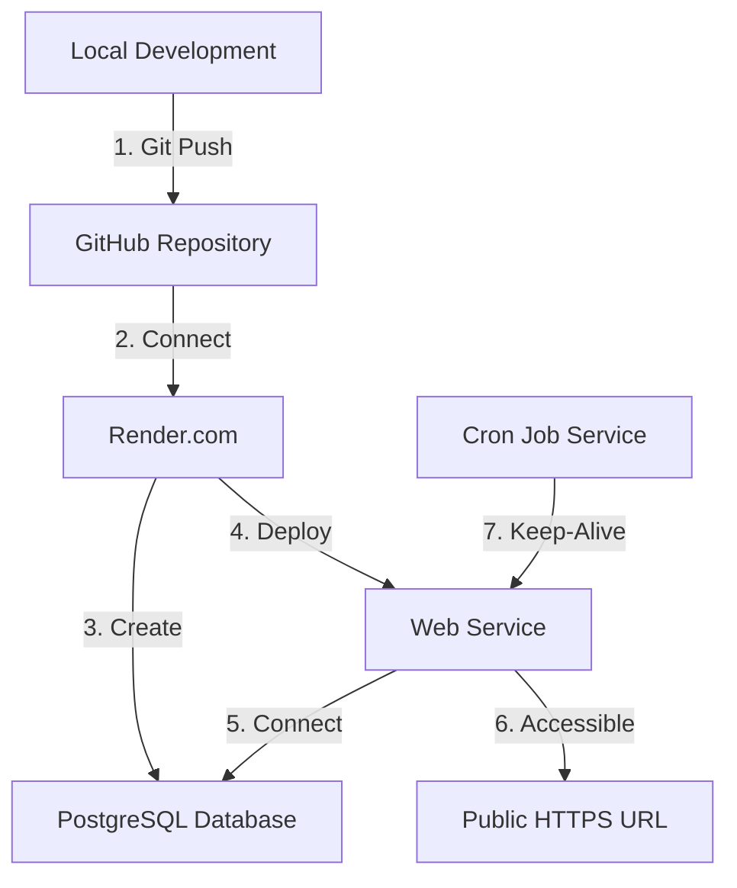

# Deployment Resources Summary

All files and guides needed to deploy your Church Census Backend to Render.com.

## 📚 Documentation Files Created

### For Different User Types

**🚀 Quick Start (5 minutes)**
- **File**: [QUICK_DEPLOY.md](./QUICK_DEPLOY.md)
- **For**: Users who want fastest deployment
- **Contains**: Minimal steps, copy-paste commands

**👁️ Visual Guide (Detailed)**
- **File**: [DEPLOYMENT_VISUAL_GUIDE.md](./DEPLOYMENT_VISUAL_GUIDE.md)
- **For**: First-time deployers, visual learners
- **Contains**: Step-by-step with screenshots placeholders, troubleshooting

**📖 Complete Reference**
- **File**: [RENDER_DEPLOYMENT.md](./RENDER_DEPLOYMENT.md)
- **For**: Comprehensive understanding
- **Contains**: All details, alternatives, best practices

**☑️ Checklist Format**
- **File**: [DEPLOYMENT_CHECKLIST.md](./DEPLOYMENT_CHECKLIST.md)
- **For**: Systematic deployers
- **Contains**: Checkboxes, verification steps, notes section

## 🛠️ Configuration Files

### render.yaml
- **Purpose**: Blueprint for automatic deployment
- **Usage**: Render can auto-detect and deploy using this
- **Contains**: Service and database configuration

### .env.example
- **Purpose**: Template for environment variables
- **Usage**: Copy to `.env` and fill in values
- **Contains**: All required environment variables with examples

### .gitignore
- **Purpose**: Prevent secrets from being committed
- **Usage**: Automatic with Git
- **Contains**: node_modules, .env, logs

## 🧪 Testing Tools

### test-deployed-api.js
- **Purpose**: Verify deployed API is working
- **Usage**: `node test-deployed-api.js https://your-app.onrender.com`
- **Tests**: All major endpoints, returns pass/fail report

### test-connection.js
- **Purpose**: Test local database connection
- **Usage**: `npm run test:db`
- **Tests**: Database connectivity before deployment

## 📊 Updated Files

### README.md
- Added comprehensive deployment section
- Updated API endpoints list
- Added keep-alive information

### package.json
- Added `test:deployed` script
- All dependencies listed for Render

## 🎯 Deployment Process Overview



## ⚡ Quick Command Reference

### Local Development
```bash
npm install          # Install dependencies
npm run dev          # Start with nodemon
npm run test:db      # Test database connection
```

### Git Deployment
```bash
git add .
git commit -m "Update"
git push             # Auto-deploys to Render
```

### Testing Deployed API
```bash
# Test script
npm run test:deployed https://your-app.onrender.com

# Manual curl tests
curl https://your-app.onrender.com/api/health
curl https://your-app.onrender.com/api/members
curl https://your-app.onrender.com/api/stats
```

## 📋 Deployment Steps Summary

### 1. Prepare (Local)
- [ ] Code working locally
- [ ] All changes committed
- [ ] Pushed to GitHub

### 2. Database (Render)
- [ ] PostgreSQL created
- [ ] Database URL copied

### 3. Web Service (Render)
- [ ] Repository connected
- [ ] Environment variables set
- [ ] Service deployed

### 4. Verify
- [ ] Health check responds
- [ ] API endpoints work
- [ ] Database connected

### 5. Keep-Alive
- [ ] Cron job configured
- [ ] Service stays awake

## 🔗 Important URLs

**Render Platform**
- Dashboard: https://dashboard.render.com
- Documentation: https://render.com/docs
- Community: https://community.render.com
- Status: https://status.render.com

**Keep-Alive Services**
- Cron-Job.org: https://cron-job.org
- UptimeRobot: https://uptimerobot.com

**Your Deployment** (Fill in after deployment)
- API URL: _______________________________
- Database: _______________________________
- GitHub: _______________________________

## 💡 Tips for Success

1. **Same Region**: Deploy database and web service in same region
2. **Environment Variables**: Double-check DATABASE_URL is correct
3. **First Request**: First request after sleep takes 30-60 seconds
4. **Keep-Alive**: Set up immediately after deployment
5. **Logs**: Check logs regularly for errors
6. **Auto-Deploy**: Disabled if you need manual control

## 🚨 Common Issues & Solutions

| Issue | Solution |
|-------|----------|
| Deploy fails | Check build logs, verify dependencies |
| Database error | Verify DATABASE_URL, check region |
| Service slow | Normal on wake-up, set up cron job |
| CORS errors | Configure CORS in server.js |
| 404 errors | Check route paths match |

## 📞 Getting Help

1. **Check Logs**: Render dashboard → Your service → Logs tab
2. **Documentation**: Review deployment guides
3. **Community**: Render community forum
4. **Support**: Render support (for critical issues)

## ✅ What You Get

After successful deployment:

- ✅ **Backend API**: Running 24/7 on Render.com
- ✅ **PostgreSQL Database**: 1GB storage (free tier)
- ✅ **HTTPS**: Automatic SSL certificate
- ✅ **Auto-Deploy**: From GitHub pushes
- ✅ **Monitoring**: Logs, metrics, alerts
- ✅ **Backups**: Automatic daily backups
- ✅ **Zero Cost**: Completely free

## 🎯 Next Tasks

After deployment is complete:

1. **Task 5**: Set up cron job for keep-alive
2. **Task 6**: Initialize React Native mobile app
3. **Task 7+**: Implement mobile app screens
4. **Update Mobile App**: Configure API URL in mobile app

## 📊 File Structure

```
backend/
├── 📖 DEPLOYMENT_SUMMARY.md          ← You are here
├── 🚀 QUICK_DEPLOY.md                ← 5-minute guide
├── 👁️ DEPLOYMENT_VISUAL_GUIDE.md     ← Step-by-step with visuals
├── 📖 RENDER_DEPLOYMENT.md           ← Complete reference
├── ☑️ DEPLOYMENT_CHECKLIST.md        ← Checkbox format
├── ⚙️ render.yaml                    ← Render blueprint
├── 🧪 test-deployed-api.js           ← API testing script
├── 📄 .env.example                   ← Environment template
├── 🚫 .gitignore                     ← Git exclusions
├── 📚 README.md                      ← Updated with deployment info
└── 📦 package.json                   ← Added test:deployed script
```

## 🎓 Learning Path

**Beginner**: Start with DEPLOYMENT_VISUAL_GUIDE.md  
**Intermediate**: Use QUICK_DEPLOY.md  
**Advanced**: Reference RENDER_DEPLOYMENT.md  
**Systematic**: Follow DEPLOYMENT_CHECKLIST.md  

---

## 🎉 Ready to Deploy?

Choose your guide based on your preference:

1. **Want fastest deployment?** → [QUICK_DEPLOY.md](./QUICK_DEPLOY.md)
2. **Need detailed walkthrough?** → [DEPLOYMENT_VISUAL_GUIDE.md](./DEPLOYMENT_VISUAL_GUIDE.md)
3. **Want comprehensive info?** → [RENDER_DEPLOYMENT.md](./RENDER_DEPLOYMENT.md)
4. **Like checkboxes?** → [DEPLOYMENT_CHECKLIST.md](./DEPLOYMENT_CHECKLIST.md)

**All paths lead to the same result**: Your backend running on Render.com! 🚀

---

**Questions?** Check the troubleshooting sections in each guide.

**Good luck with your deployment!** 🍀
